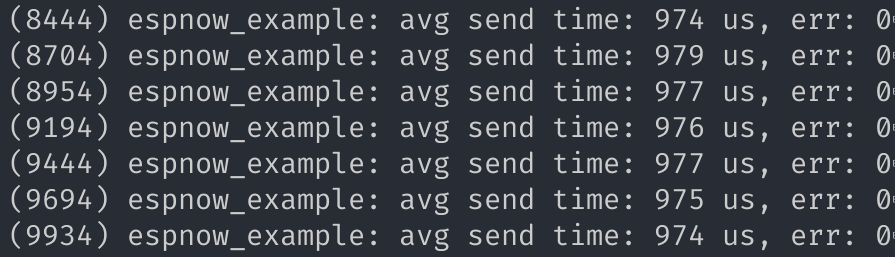
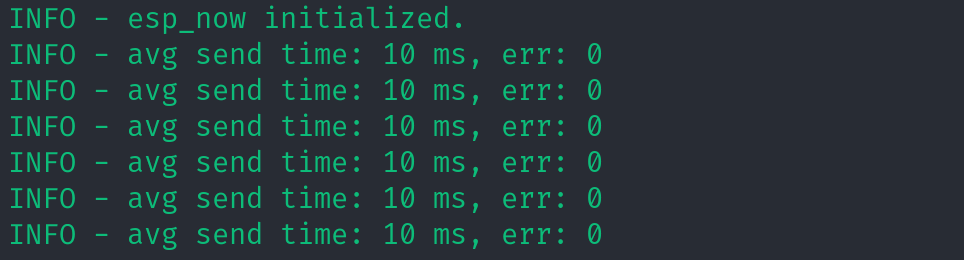
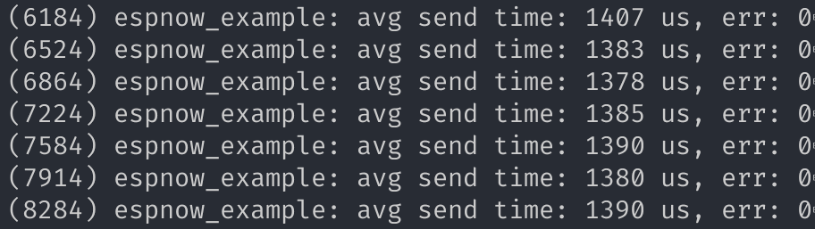
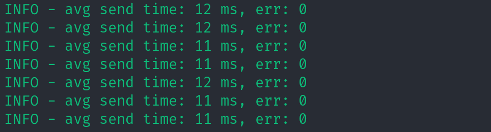

Tests for esp now send timing.

Environment:

- hardware: ESP32-C3-MINI-1 (for both rx and tx)
- esp-idf version: v5.1-cbce221

WiFi initial configs are kept the same.

Before testing, use `cargo espflash flash --bin rx --release --monitor` to flash a receiver and fill its mac address to `s_example_peer_mac` of C code and `RX_ADDR` of Rust code. Keep the receiver running when testing.

### Broadcast:

C version (set `BENCH_UNICAST` to 0):

Rust version (`cargo espflash flash --bin tx --release --monitor`):

### Unicast:

C Version (set `BENCH_UNICAST` to 1):

Rust version (`cargo espflash flash --bin tx --features unicast --release --monitor`):

